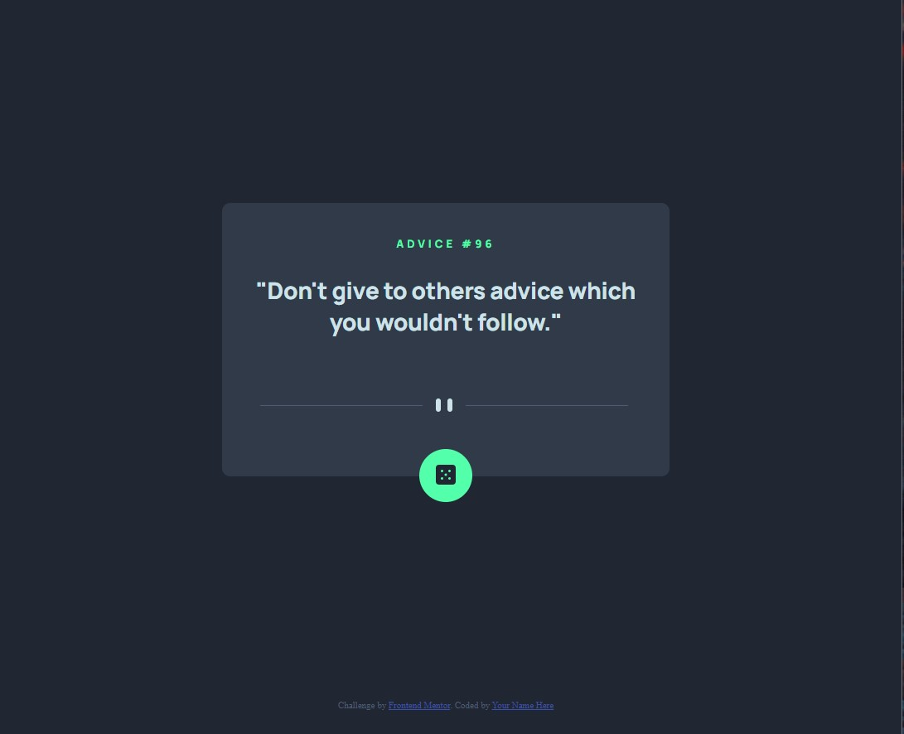

# Frontend Mentor - Advice generator app solution

This is a solution to the [Advice generator app challenge on Frontend Mentor](https://www.frontendmentor.io/challenges/advice-generator-app-QdUG-13db). Frontend Mentor challenges help you improve your coding skills by building realistic projects.

## Table of contents

- [Overview](#overview)
  - [The challenge](#the-challenge)
  - [Screenshot](#screenshot)
- [My process](#my-process)
  - [Built with](#built-with)
  - [What I learned](#what-i-learned)
- [Author](#author)

## Overview

### The challenge

Users should be able to:

- View the optimal layout for the app depending on their device's screen size
- See hover states for all interactive elements on the page
- Generate a new piece of advice by clicking the dice icon

### Screenshot



## My process

### Built with

- Semantic HTML5 markup
- CSS custom properties
- Flexbox
- Mobile-first workflow
- JavaScript
- Google fonts
- Advice Slip JSON API

### What I learned

During this proect I repeated how to connect with JSON API that is available via URL.

Below a code snippet that I am proud of within this project.

```js
function getAdvice() {
  fetch("https://api.adviceslip.com/advice")
    .then((res) => res.json())
    .then(
      (data) =>
        (ADVICE.innerHTML = `
    <h1> Advice #${data.slip.id}</h1>
    <p>"${data.slip.advice}"
    `)
    );
}
```
